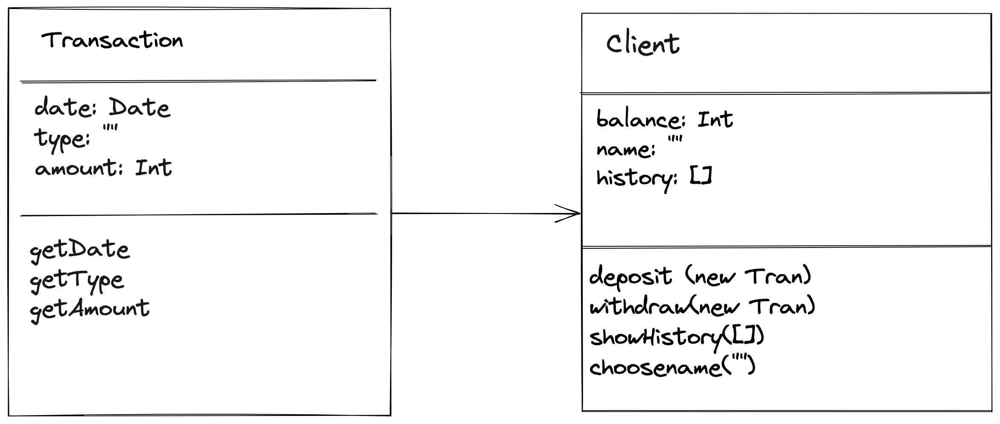

# Bank tech test

Today, you'll practice doing a tech test.

## Requirements

- To run the program please clone the repo from github at https://github.com/eddiearnoldz/bank_tech_test
- Ensure you have node installed: guide here https://nodejs.org/en/download/
- cd into the bank_tech_test repository and type ```npm install``` in the terminal
- To run the program type ```npm start```
- To run the test suites type ```jest``` in the terminal

### Specifications

* You should be able to interact with your code via a REPL like IRB or Node.  (You don't need to implement a command line interface that takes input from STDIN.)
* Deposits, withdrawal.
* Account statement (date, amount, balance) printing.
* Data can be kept in memory (it doesn't need to be stored to a database or anything).

# Initial thoughts

- Clients should be members of a bank
- they each have an account
- the balance should be saved in the client object and altered with deposit or withdraw functions.    These take one argument. An amount. Date added on transaction
- the balance could be rendered after each function is called in the specified layout.
- a grid/template is created to show the transactions and final balance in CLI


# Screenshots of CLI




# Reflections

Overall this was a challenging exercise that allowed me to improve my testing capability with jest as well as dependency injection with classes. I struggled to find an effective way to test the readline CLI i had created and therefore this remains a challenge to explore in the future. I would also like to create a Parent class of bank that the client accounts could be stored in.

The biggest challenge turned out to be accessing the Transaction objects stored in the history of the account's array. I initially tried mapping but could not acces the objects nested inside and eventually found a simple for loop created the extra level of accesibility i needed to capture and print the values i needed to the terminal.

I also found the import/export or require system hard to juggle when introducting boxen and this was resolved using "type":"module" in the package.json after some lengthy googling.

The last stumbling block was formatting the date but i now will never forget .toLocaleDateString()! I had imported 'moment' but found that it was hard again to export across classes and files.


### Acceptance criteria

**Given** a client makes a deposit of 1000 on 10-01-2023  
**And** a deposit of 2000 on 13-01-2023  
**And** a withdrawal of 500 on 14-01-2023  
**When** she prints her bank statement  
**Then** she would see

```
date || credit || debit || balance
14/01/2023 || || 500.00 || 2500.00
13/01/2023 || 2000.00 || || 3000.00
10/01/2023 || 1000.00 || || 1000.00
```